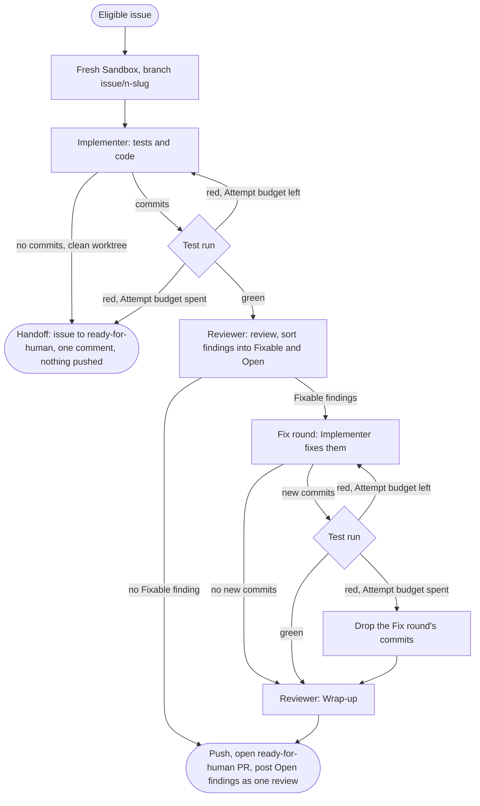

# afk-loop

The AFK loop: it takes a repo's `ready-for-agent` issues, has agents implement, review and test them in a Sandbox (a Tart macOS VM), and hands back PRs. It never merges one. Vocabulary: [`GLOSSARY.md`](GLOSSARY.md). Decisions: [`docs/adr/`](docs/adr/).

This repo holds no project's details and imports nothing outside itself. A project reaches it through its entry module, [`index.ts`](index.ts), and its command, `afk-loop`.

## The loop

One Eligible issue at a time, up to the cap:



The Host runs the loop and holds the GitHub token; the agents and the Test runs execute in the Sandbox, which has none. The Sandbox is deleted when the issue's run ends.

- **Issue**: the Host pastes into each agent's prompt every issue the issue body names, except those under its Parent and Blocked by headings. An issue with an open blocker waits for a later run, once the blocker's PR is merged.
- **Test run**: the `steps` of each present platform whose folder the branch changes against the base branch. The Reviewer gets the same platforms' `standards`. A branch changing no platform's folder has neither.
- **Attempt budget**: 3 failed Attempts per issue, shared by the Implementer's first round and its Fix round. Uncommitted changes left in the Sandbox are a failed Attempt.
- **Reviewer**: read-only. After each Reviewer run the Host puts the branch back at the commit the Test run passed, so the pushed commit is always a tested one.
- **Fixable or Open**: a finding is Open when its fix needs the maintainer's decision or reaches outside the diff, or when the Reviewer is not sure it is valid. Every other finding is Fixable.
- **Fix round**: one per issue. The Implementer may leave a finding it judges wrong, with its reason. When the Attempt budget is spent here the PR still opens, on the first round's green commit, and its body says the fixes are not included.
- **Wrap-up**: reviews the Fix round's commits only. Each Fixable finding left unfixed and each new finding becomes an Open finding. It never starts a second Fix round.
- **PR**: body is `Closes #n.`, the Reviewer's draft, then the Host's lines (who worked it, the count of Open findings, what the Test run verified). An Open finding with a line in the diff is an inline comment; the rest are in the review's body.
- **Unreadable Reviewer reply**: in the review, the run stops with an error and no PR. In the Wrap-up, the Host posts the review's Open findings, plus the Fixable findings as one Open finding marked unchecked.
- **Handoff**: the comment gives why, the last Attempt's feedback, the log's path and the branch's name. What the session left is on the Host, on the local branch or uncommitted in its worktree. To requeue: remove the local branch and its worktree, if they are still there, then relabel the issue `ready-for-agent`.
- **Logs**: the project's `.sandcastle/logs/`, on the Host. Raw Test run output is in `<branch>-test-run.log`.

## A project's `.sandcastle/`

- `package.json` and its lockfile, depending on `afk-loop`.
- `loop.config.ts`: its default export is `defineLoop({ name, repo, image, smokeIssue, platforms })`, imported from `afk-loop`. `model` and `baseBranch` (`main`) are optional.
- `.env` (the Sandbox's env) and `host.env` (stays on the Host), with their `.example` files.
- Gitignored: `node_modules/`, `logs/`, `worktrees/`, `runs/`.

A platform names its folder, its coding standards, its build line for the agents' prompts, the Verified line of its PRs, and its Test run steps, written as project code. With `presentWhen`, it is present once that file is on the branch. Every VM name comes from `name`: `<name>-base`, `<name>-issue-<n>`, `<name>-smoke`.

## Setup

Needs Node 22+, an Apple Silicon Mac and [Tart](https://tart.run) (`brew install cirruslabs/cli/tart`).

```bash
npm --prefix .sandcastle ci
cp .sandcastle/.env.example .sandcastle/.env
cp .sandcastle/host.env.example .sandcastle/host.env
npx --prefix .sandcastle afk-loop build-image
```

Fill both env files from the comments in each.

`build-image` builds the base VM `<name>-base`: the config's image, Claude Code, the skills plugin at the tag `loop/skills-plugin.ts` pins, the config's provision steps, and one Test run to warm the caches. Rebuild after changing `loop/build-image.ts`, the plugin tag or the config's image, and when a `presentWhen` file first lands on the base branch.

## The command

```bash
npx --prefix .sandcastle afk-loop run [--cap 5]
npx --prefix .sandcastle afk-loop smoke
npx --prefix .sandcastle afk-loop build-image
```

It finds `.sandcastle/loop.config.ts` from the git root. From a subfolder, give `--prefix` the repo's `.sandcastle/`: `npx --prefix "$(git rev-parse --show-toplevel)/.sandcastle" afk-loop smoke`.

`smoke` is green when the Host reads an issue, the Sandbox has no GitHub token, an agent in the Sandbox reads the repo and lists its skills, a Sandbox commit reaches the Host branch unchanged, and the Test run over every present platform passes.

## What a repo needs

Before `run` and `smoke` open any Sandbox, the Preflight checks these and stops with one list of everything missing, each with its fix:

- On `origin/<baseBranch>`: `GLOSSARY.md` at the root, `docs/agents/git-conventions.md`, and each platform's `standards` file. `GLOSSARY-MAP.md` is optional.
- On GitHub: the labels `ready-for-agent` and `ready-for-human`.

Unchecked: the loop imposes its branch `issue/<n>-<slug>`, commit and PR title `[#n] - Summary`, and `Closes #n.`; the repo's `git-conventions.md` must agree.

## Tests

```bash
npm ci
npm test
npm run typecheck
```

`loop/folder.test.ts` holds this repo to its rule: no project named, nothing imported from outside.
